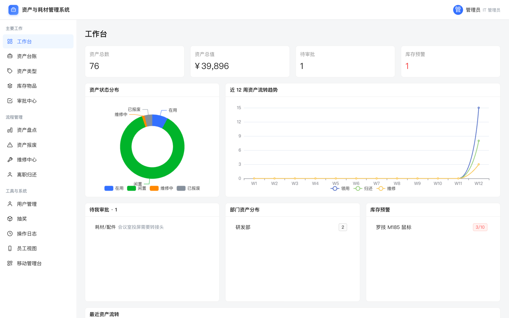
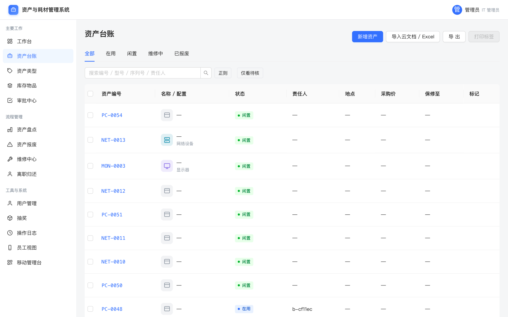
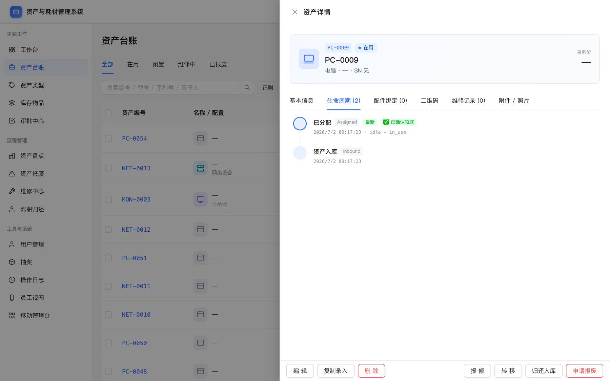
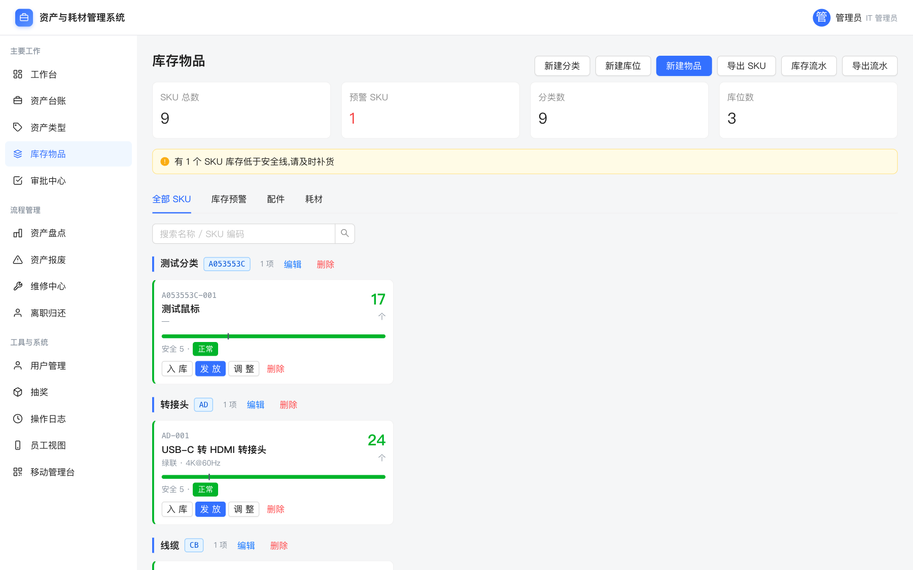
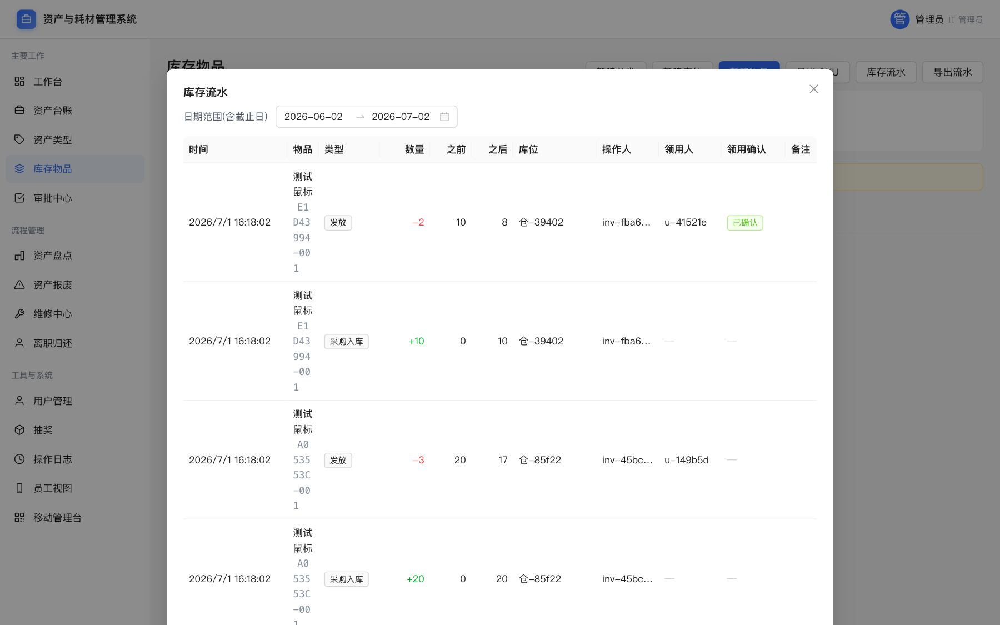
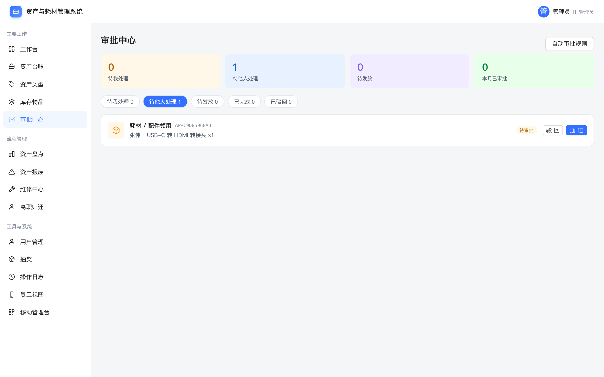
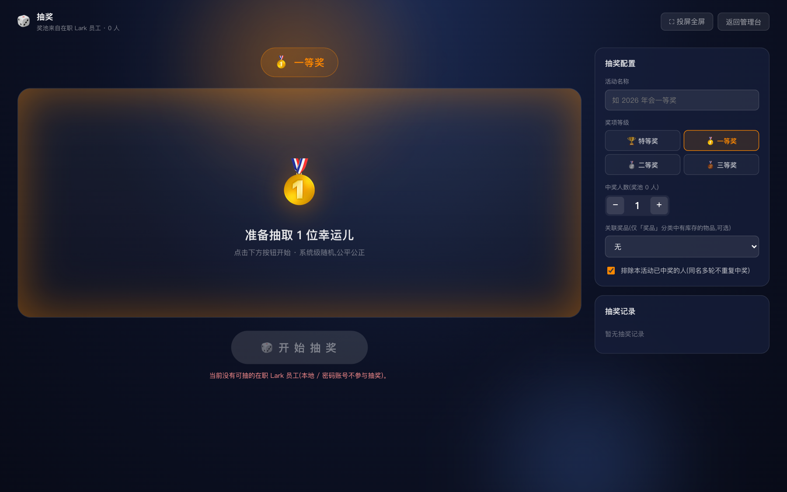

# 资产与耗材管理系统

基于 Lark/飞书的轻量资产与耗材库存管理系统。管理端 Web 后台 + 员工端 Lark H5。

## 产品功能介绍

把 IT 资产从"云文档台账"升级为带流程、可追溯、员工自助的管理系统。三端协同:**Web 后台**(IT/行政)、**Lark H5 员工端**、**手机移动管理台**(现场扫码)。

- **资产台账** —— 个人发放 / 基础设施两类;自动编号(`PC-0001`);新增/**复制录入**(批量录同型号)/云文档导入(容脏)/导出;分配·转移·归还、启用·停用、报修、报废;详情含生命周期/配件/二维码/附件。
- **二维码标签打印** —— 多种 A4 布局 + **A204 模切纸**预设;**起始位置选格**复用撕剩的标签纸,减少浪费。
- **库存耗材** —— SKU / 入库 / 领用 / 流水 / 低库存预警。
- **审批中心** —— 员工申请 → 主管/IT 审批 → IT 发放(耗材自动扣库存);批量审批、审批意见、**自动审批规则**、Lark 卡片一键同意/拒绝。
- **资产盘点** —— 按范围建任务,手机**扫码 → 看详情 → 手工确认/标记差异**,进度统计。
- **维修中心 / 资产报废** —— 维修工单状态机;报废**双人复核**审批链。
- **离职归还** —— 自动/手工建单回收资产,**通知闸门**(自动化只提醒 IT,IT 确认后才通知员工)。
- **年会抽奖** —— 全屏大屏三阶段(配置 → 老虎机滚动 → 揭晓 + 彩带);奖池=在职 Lark 员工、系统级随机;奖项等级主题色、关联「奖品」分类**有库存**的物品、抽后在历史里**确认出库**才扣库存、同名多轮可**排除已中奖者**;记录可删/清空。
- **Lark/飞书集成** —— 免登、通讯录同步、消息卡片、离职事件订阅。
- **审计日志 / 用户角色** —— 关键操作可追溯;**7 种角色**细分权限(含人力资源 HR:可查看离职归还、使用抽奖)。

📖 详细操作见 **[用户手册 · docs/USER_MANUAL.md](docs/USER_MANUAL.md)**。

## 功能预览

> 截图取自内置演示数据(`python -m app.seed_demo` 生成)。


<sub>工作台 —— 资产总数/总值/待审批/库存预警 KPI、状态分布、流转趋势、待办聚合。</sub>

| | |
|---|---|
| **资产台账** —— 自动编号、状态流转、批量导入/导出<br> | **资产详情** —— 生命周期时间线 + 领用确认回执<br> |
| **库存耗材** —— SKU / 入库 / 领用 / 低库存预警<br> | **库存流水** —— 出入库明细,含领用人 / 领用确认<br> |
| **审批中心** —— 申请→审批→发放,批量与自动规则<br> | **年会抽奖** —— 全屏大屏三阶段抽奖<br> |

> **设计与需求文档**(唯一基准 = PRD v0.2):
> - 业务需求:[`design_handoff_it_asset/PRD.md`](design_handoff_it_asset/PRD.md)
> - 设计规格 / 屏幕 / Design Tokens:[`design_handoff_it_asset/README.md`](design_handoff_it_asset/README.md)
> - 开发计划 / Sprint / 技术栈:[`design_handoff_it_asset/DEVELOPMENT_PLAN.md`](design_handoff_it_asset/DEVELOPMENT_PLAN.md)
> - 年会抽奖大屏设计:[`design_handoff_it_asset/LOTTERY_DESIGN.md`](design_handoff_it_asset/LOTTERY_DESIGN.md)
> - 高保真原型(仅视觉/交互参考,不进生产):`design_handoff_it_asset/prototype/`

## 技术栈

- **后端**:Python 3.11 · FastAPI · SQLAlchemy 2.0 · Alembic · Celery · PostgreSQL 16 · Redis 7
- **前端**:TypeScript 5 · React 18 · Vite · Ant Design 5 · TanStack Query · Zustand
- **基建**:Docker Compose(开发)· MinIO(对象存储)

## 快速开始

前置:Docker + Docker Compose。

```bash
cp .env.example .env          # 按需修改配置(Lark app_id/secret 等)
make up                       # 起 postgres + redis + minio + backend + frontend
make migrate                  # 跑数据库迁移
```

启动后:

| 服务 | 地址 |
|---|---|
| 后端 API | http://localhost:8000 |
| API 文档 (OpenAPI) | http://localhost:8000/docs |
| 健康检查 | http://localhost:8000/health |
| 前端 | http://localhost:5173 |

常用命令见 `make help`。

## 目录结构

```
it-asset/
├── backend/                  FastAPI + SQLAlchemy + Alembic
├── frontend/                 Vite + React + TS + Ant Design
├── design_handoff_it_asset/  设计/需求/计划/原型(基准文档)
├── docker-compose.yml        本地开发编排
├── .env.example              配置示例
└── Makefile                  make up / migrate / test / lint
```

## Lark / 飞书 接入权限

在[飞书开放平台 · 开发者后台](https://open.feishu.cn/app)对应用配置。分三块:**能力(Capabilities)**、**权限(Scopes)**、**事件订阅**。

### 1. 应用能力(在「应用能力」里开通)

| 能力 | 用途 | 代码位置 |
|---|---|---|
| 机器人 Bot | 发卡片/文本消息(审批通知、库存预警、离职提醒) | `im/v1/messages` |
| 网页应用 H5 | 员工端 `/m` 免登 + JSSDK 扫码 | `authen/v1/access_token`、`jssdk/ticket/get` |
| 长连接事件订阅 | 审批卡片回调、员工离职事件 | `app/lark/ws_client.py` |

### 2. 权限 Scopes(「权限管理」)

| Scope | 干什么 | 调用 |
|---|---|---|
| `contact:user.base:readonly` | 读用户基本信息(通讯录同步 / 免登读登录人) | `/contact/v3/users/batch`、`/contact/v3/scopes` |
| `contact:user.email:readonly` | 读用户邮箱(同步进 `users.email`) | 同上 |
| `contact:department.base:readonly` | 读部门(同步部门树) | `/contact/v3/departments/batch` |
| `im:message:send_as_bot` | 以应用身份发消息 | `/im/v1/messages` |

> 免登拿登录用户身份用 **user_access_token**(`authen/v1/access_token`),其余通讯录拉取 + 发消息用 **tenant_access_token**。
> 精确 scope 名以后台「权限管理」搜索结果为准(飞书偶有改名)。

### 3. 事件订阅(「事件与回调」→ 长连接)

| 事件 | 用途 |
|---|---|
| 审批任务/卡片交互回调 | Lark 卡片上点[同意]/[拒绝] → `apply_card_decision` |
| 员工离职 / 删除(`contact.user.deleted`) | 自动建离职归还工单(仅通知 IT,见 `MOBILE_ADMIN` 闸门) |

### 4. 批量开通 JSON

后台「权限管理」→ 「**导入**」,粘贴:

```json
{
  "scopes": {
    "tenant": [
      "contact:user.base:readonly",
      "contact:user.email:readonly",
      "contact:department.base:readonly",
      "im:message:send_as_bot"
    ],
    "user": [
      "contact:user.base:readonly"
    ]
  }
}
```

> **规划中**:若接入飞书审批中心(见 [`design_handoff_it_asset/LARK_APPROVAL_INTEGRATION.md`](design_handoff_it_asset/LARK_APPROVAL_INTEGRATION.md)),`tenant` 再加 `"approval:approval"`。
>
> 配完别忘 **发布版本并等审核通过**,scope 才生效;`.env` 填 `LARK_APP_ID/SECRET`、事件订阅的 `LARK_VERIFICATION_TOKEN/ENCRYPT_KEY`。

## 开发状态

> 截至 2026-06-19。计划见 [`DEVELOPMENT_PLAN.md` §5](design_handoff_it_asset/DEVELOPMENT_PLAN.md);Phase 2/3 设计补充见同目录 `PHASE2_DESIGN.md` / `PHASE3_PREVIEW.md` / `MOBILE_ADMIN.md`。

**Phase 0 数据迁移** ✅ — 云文档/Excel 导入(容脏入库,脏数据进 `needs_review`)、`legacy_code`、报废候选标记、按类型前缀的编号 sequence。

**Phase 1 MVP** ✅ — 用户/部门 + Lark 通讯录同步 + 免登(JSSDK)+ 密码登录 + 6 角色;资产台账(CRUD/筛选/详情抽屉/分配·归还·转移·报修·报废/状态机/审计/QR/资产类型含分类图标);库存(SKU/入库/领用/流水/预警);审批流;员工端 H5 `/m`、工作台、盘点、审计日志。

**Phase 2 流程化** ✅ — 后端全就绪 + 前端视觉打磨完成:
- 盘点看板(按责任人分组 + 环形进度)、维修中心(漏斗 + 状态机时间线)、报废审批链(头像审批链)、审计时间线、二维码标签打印
- 编辑改资产类型(换前缀重新生成编号)、基础设施直接改状态(启用/停用)、序列号扫条形码录入
- 移动管理台闭环:首页 / 扫码 / 资产台账(列表·新增·详情·编辑)/ 库存 / 审批(列表 + 底部抽屉处理)/ 盘点

**Phase 3 高级场景** 🟡 进行中:
- ✅ 审批中心重做:enrich(真实姓名/SKU 名)、审批意见、批量审批、`scope=all` 历史、**Lark 卡片预览**
- ✅ 自动审批规则:满足条件(仅耗材、数量/金额不超上限、SKU 未标需审批)的申请自动通过,留「系统自动」标识
- ✅ 离职归还(offboarding):自动/手工建单 + 确认归还/登记丢失/关闭 + **通知闸门**(自动化只通知 IT,IT 确认后才通知员工)+ Lark `user.deleted` 自动建单 + Celery 逾期扫描
- ✅ 年会抽奖:全屏大屏三阶段 + 奖项等级 + 关联「奖品」分类有库存物品(**确认出库**才扣库存)+ 同名多轮可排除已中奖者 + 历史删/清空
- ✅ 人力资源(HR)角色:可查看离职归还(只读)、使用抽奖
- ⬜ 飞书审批中心接入(设计稿见 `LARK_APPROVAL_INTEGRATION.md`)

**端到端冒烟**:`tests/test_smoke_e2e.py` 串起 建资产→分配→盘点→报修→报废→基础设施改状态→耗材审批发放→Dashboard 全主路径。
